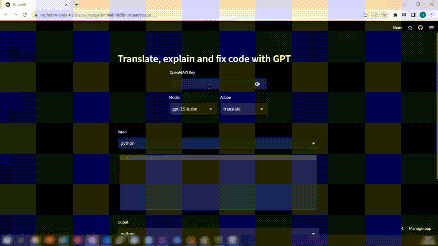

# PolyglotCode: A Python app for translating, fixing and explaining code with AI.

:link: [Live demo](https://nechubm-code-translator-srcapp-12xkmi.streamlit.app/)

PolyglotCode is a simple Python app that uses the power of AI to translate, fix, and explain code. With only 100 lines of code, this app is easy to use and a great way to learn about creating apps and working with ChatGPT and AI.



## Introduction
PolyglotCode is an awesome project that demonstrates the power of AI and the ease of creating apps using Python. To learn how to build this app step by step follow the tutorial in the Youtube link below (**English and Spanish**).
For developing the app in just 100 lines of code and only using Python we need:
* ChatGPT API
* Streamlit

:warning: Tutorial code in branch [tutorial](https://github.com/NechuBM/code-translator/tree/tutorial)

[English tutorial | Youtube](https://youtu.be/F0nnsrcvrsc)

[Tutorial en Español | Youtube](https://youtu.be/2kyscxiE8gc) 

## The Awesome Project We Can Build
Are you tired of spending hours trying to figure out what's wrong with your code? Do you want to learn more about how AI can help you fix and explain code? Then PolyglotCode is the app for you! With PolyglotCode, you can simply paste your code into the app and let AI do the rest. The app will translate your code into plain English, fix any errors it finds, and explain how the code works.


* Save time by quickly identifying and fixing errors in your code
*Improve your programming skills by understanding how your code works and how to improve it
* Learn about AI and how it can be used to automate programming tasks
* By using PolyglotCode, you'll be able to create better code faster and with less frustration. And the best part? You can do it all with just 100 lines of code!

## How to Use PolyglotCode
Using PolyglotCode is easy! Here are the steps:
1. Clone or download the repository to your local machine.
2. Install the required libraries by running the following command in your terminal:
```console
pip install -r requirements.txt
```
3. Move to the *src* folder and run the app using the following command:
```console
streamlit run app.py
```
4. Obtain an API key from OpenAI to use their ChatGPT API.
5. Select 'Translate', 'Explain' or 'Fix' code.
6. Paste your code into the text box on the app.
7. Click the "Run" button and let AI do the rest!

## Conclusion
PolyglotCode is a great project that shows how easy it is to create powerful apps using ChatGPT and Streamlit. With only 100 lines of code and Python you can build an app that translates, fixes and explains code, saving you time and improving your programming skills. Give it a try today and see how it can help you write better code faster!